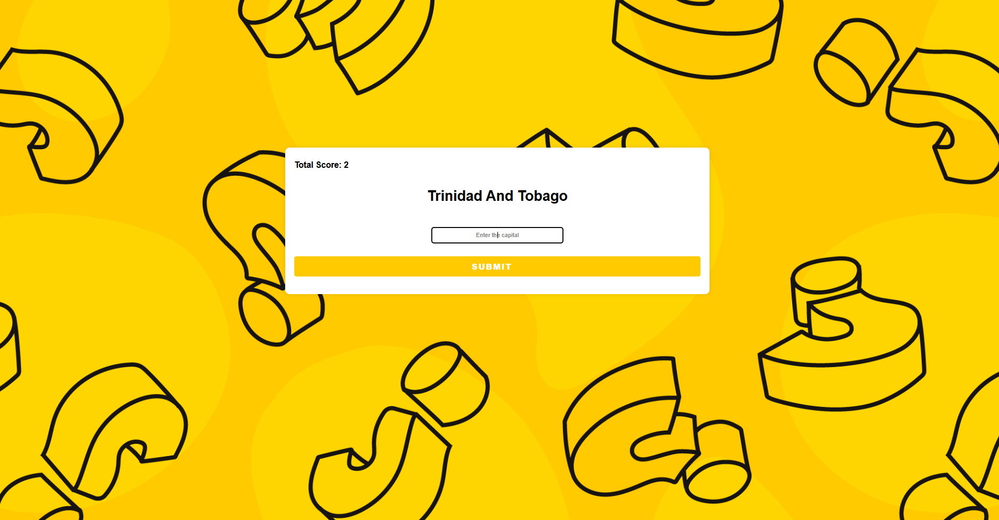
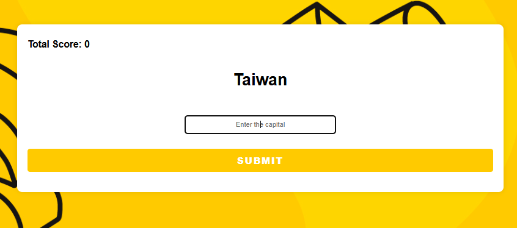

# 🌍 World Capitals Project (Express.js + PostgreSQL + EJS)


---

This is a simple World Capitals App built with Express.js, PostgreSQL, and EJS.
Users can view the list of countries and their capitals, and add new entries via a form.
The app demonstrates full-stack integration with a PostgreSQL database and server-side rendering.
Screenshots below showcase the main pages and functionality of the app.

---

## 📷 Gallery

| Quizz| Quizz|
|--------|--------|
|  |  |

| Quizz |
|--------|
|  |

---

 1️⃣ Create Table in PostgreSQL
```sql
CREATE TABLE capitals1 (
    id SERIAL PRIMARY KEY,
    country VARCHAR(45),
    capital VARCHAR(45)
);
```
2️⃣ Install Dependencies
```bash
npm i
npm i pg express ejs body-parser
```

3️⃣ Database Connection (index.js)
```bash
const app = express()
const db = new pg.Client({
  user: "postgres",
  host: "localhost",
  database: "XXXXX",    // <-- your database name
  password: "XXXXX",    // <-- your password
  port: XXXX,           // <-- your port name
});

4️⃣ Run Server
```bash
node index.js
```
---
👉 [Open App on Localhost](http://localhost:3000)
